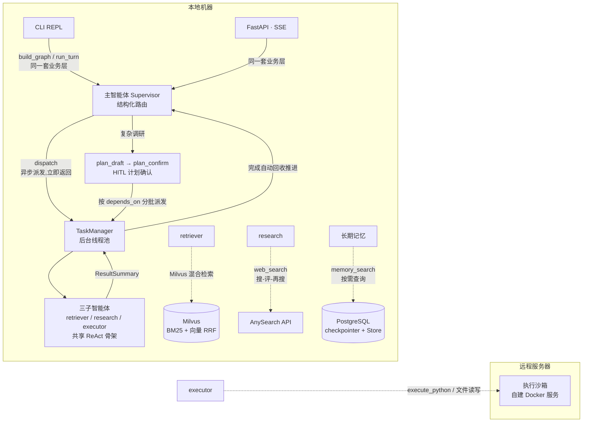

# TaskForce

**基于 LangGraph 的企业级投资调研助手:知识库问答(研报/公告/财报)、联网调研、沙箱代码执行,CLI / HTTP API / Web 工作台三入口;复杂调研自动拆解为计划(todolist),经确认后多智能体接力执行。**

单用户本地部署,Windows 开发机,uv 管理,Python 3.12。

## 技术栈

| 层 | 选型 |
|---|---|
| **编排** | LangGraph 1.x:主图九节点(supervisor 结构化路由 + answer/ask/memory + plan_draft/plan_confirm)+ 3 个 ReAct 子图;`Send` 动态 fan-out、`interrupt` 单点 HITL、Postgres checkpointer / Store |
| **模型** | 全部走 **OpenAI 兼容协议**:LLM(火山方舟豆包 / DeepSeek)、Embedding(智谱 / 百炼);base_url / api_key / 模型名可在设置页改,不锁死在代码里 |
| **后端** | FastAPI(七 router;**全同步 `def` 端点**,由 FastAPI 丢线程池,零 async)+ SSE 同步 generator + Pydantic v2 |
| **存储** | PostgreSQL + pgvector:会话 checkpoint、长期记忆 Store;知识库检索在 **Milvus**:docling 解析、父子分块、内置 BM25 + 向量双路召回 + RRF 融合(中文分词 jieba) |
| **工具能力** | 内置文件读写 + 时钟工具 + MCP(stdio / streamable-http 双协议,失败降级)+ Skills 渐进式加载 + AnySearch 联网 + 远程 Docker 沙箱执行 |
| **前端** | Vue 3.5 `<script setup>` + TypeScript strict + Vite 7 + Pinia + vue-router(hash)+ **原生 CSS 设计令牌,零 UI 库**;SSE 走 fetch + ReadableStream 手工分帧 |
| **工程** | uv(依赖与运行)、hatchling(src 七包)、ruff、pytest、vitest / vue-tsc、docker compose |

## 架构



计划执行(plan-and-execute):planner 生成 todolist → 用户 interrupt 确认 → 按 depends_on 分批派发;推进由 supervisor 确定性完成(task_id 对账、失败级联、依赖解锁、收口汇总),不走路由 LLM。
控制面在本地、**执行面在远程沙箱**:本仓库不内置任何执行环境,只做 `execute_python` 工具接入(HTTP + Bearer)。

## 功能清单

- [x] 多智能体:supervisor 结构化路由 + retriever/research/executor 三子智能体(统一 ReAct 骨架)
- [x] 任务拆分(plan-and-execute):复杂调研自动生成 todolist(≤5 步)、HITL 确认、按依赖分批派发、失败级联跳过、自动收口汇总
- [x] 异步派发:任务提交后台线程池,派发即返回可继续交互;全批完成自动汇总推送(不阻塞、无需询问)
- [x] 知识库 RAG:pdf/docx/md 解析(docling)、内容级防重、父子分块、BM25 + 向量混合检索(RRF 融合,Milvus)、切片管理
- [x] 联网调研:AnySearch API 直连,搜-评-再搜循环,来源引用 + 信息时点标注
- [x] 沙箱代码执行:远程 Docker 执行 Python + 工作区文件读写
- [x] Skills 渐进式加载:元数据注入主智能体,全文由 executor 按需读取
- [x] MCP 工具接入:stdio(本地)+ streamable-http(远程)双协议,失败降级
- [x] 长期记忆:memory-as-tool——`memory_search` / `store_memory` 由主智能体按需调用,不做每轮注入
- [x] 统一 HITL:ask 问询、记忆确认、计划确认三个挂起点(任意时刻至多一个,主图单挂起语义)
- [x] 会话持久化:Postgres checkpointer,`/resume` 换线程续聊;历史消息回填与骨架屏
- [x] 模型配置可视化:设置页「模型」节可改主模型 / Embedding 的 base_url、api_key、模型名(密钥掩码回显,保存后重启后端生效)
- [x] 双入口:CLI REPL 与 FastAPI SSE 共用同一 `build_graph` / `run_turn`
- [x] 用量统计:按轮增量角标 + 进程累计,`/stats` 查看

## 五分钟起步

```bash
docker compose up -d                  # 起 PostgreSQL + pgvector(映射 5433);知识库 Milvus 另见 docker-compose.milvus.yml
cp .env.example .env                  # 填 LLM / Embedding;数据库串默认已对上 compose
cp mcp_config.example.json mcp_config.json   # 可选:MCP 服务器(示例是占位,按需改)
uv sync                               # 安装依赖
uv run python -m cli.repl             # CLI 入口
```

产品智能体的用户背景与人设在 **BACKEND.md**(占位保持 `xxx`,按需填写,重启进程生效)。

Web 工作台(前端在 `dev/front/`,Vue 3 + Vite;生产形态由 FastAPI 同源托管):

```bash
cd dev/front && npm install && npm run build   # 第一次:装依赖并出构建产物
cd ../.. && uv run uvicorn api.main:app --port 8010   # 打开 http://127.0.0.1:8010
```

开发前端时用双进程(前端 5173,`/api` 由 vite proxy 剥前缀转发):`cd dev/front && npm run dev`。

> **端口约定:后端固定 `8010`,不换端口。** 本机 `127.0.0.1:8000` 是沙箱通道(`.env` 的 `SANDBOX_URL`,SSH 隧道转发到远程沙箱),
> 与后端同端口会让沙箱自检打到前端服务上、自指递归拖慢整个服务。**8010 被占用时先停掉占用进程再起**:
> `Get-NetTCPConnection -LocalPort 8010 -State Listen | ForEach-Object { Stop-Process -Id $_.OwningProcess -Force }`

> **密钥不入库**:`.env`(LLM / Embedding / 数据库 / 沙箱 / 搜索)与 `mcp_config.json`(MCP headers)都在 `.gitignore` 里,
> 仓库只提供 `.env.example` / `mcp_config.example.json` 占位模板;`BACKEND.md` 的个人信息占位保持 `xxx`,是否填真实值自行权衡;本地状态(`.taskforce/`:当前会话、模型覆盖)同样不入库。

一条命令跑测试:`uv run pytest -q && uv run ruff check .`;前端:`cd dev/front && npm run test && npx vue-tsc --noEmit`。
(当前:后端 472 passed,2026-09-25)

## 目录

```
src/
├── agent/      # 主图(supervisor/answer/ask/memory/plan_draft/plan_confirm)+ subagents/ + contracts/ + tasks.py
├── rag_v01/    # 知识库内核(docling 解析 / 父子分块 / Milvus 混合检索 / ragas 评估)
├── tools/      # tool/ skills/ mcp/ sandbox/ websearch/ rag/
├── prompts/    # 全部提示词(md 数据包,占位符 $name)
├── settings/   # config / loader / usage / session / db/ / embeddings
├── api/        # FastAPI 七 router(chat/models/knowledge/memory/skills/mcp/health)
└── cli/        # REPL(context/streaming/commands)
dev/front/      # Web 工作台(Vue 3 + Vite + Pinia,独立工程:不进 uv / hatchling / pytest)
docs/           # 设计文档 / ADR / 开发文档 / 格式违规底单 / 演示剧本
BACKEND.md      # 产品内智能体运行时背景(用户背景 / 全局指令 / 各智能体人设)
```

## 设计决策

**1. 为什么用子智能体而不是工具?**
长任务需要独立上下文、可并行、结构化回传。子图各自维护私有 ReAct 循环,只回传 ResultSummary,supervisor 是唯一叙事者——避免把多智能体压扁成"一个带一堆工具的 LLM"。

**2. 多智能体带来了什么?**
"对比宁德时代与比亚迪的毛利率并给出投资建议"会先拆成计划(检索 → 计算 → 汇总),每步派给合适的子智能体后台并行执行;派发即返回,主智能体继续响应用户;每批完成后自动推进,任务全部完成自动收口汇总(用户询问进行中则等答完再推送);结果冲突时由 answer 明示并说明采信理由。

**3. 不用 async 怎么并行?**
派发与子图执行走线程池(IO-bound 等待释放 GIL),完成事件经回调唤醒监视线程(Web 端由前端轮询 peek 端点触发汇总);全同步代码(无 async/await)降低心智负担,SSE 用同步 generator 喂 StreamingResponse。

**4. 为什么沙箱在远程?**
ADR-0007:执行面隔离,本地零污染。本仓库只做 `execute_python` 工具接入(HTTP + Bearer),不内置任何执行环境。

**5. HITL 为什么挂三处?**
interrupt 只在 ask(问询)、memory(确认)与 plan_confirm(计划确认)节点,任意时刻至多一个挂起(ADR-0008 单一挂起点,0012 扩展),REPL 与 API 同一套恢复语义。

**6. 复杂任务为什么先出计划?**
plan-and-execute(ADR-0012):**计划生成用 LLM、计划推进用确定性代码**——对账、依赖解锁、失败级联都是纯 Python 状态机,LLM 只负责把目标翻译成 todolist;推进不走路由 LLM,可靠且可测,step 对账复用 `ResultSummary.task_id` 零契约变更。

## 刻意不做(取舍理由)

| 不做 | 理由 |
|---|---|
| 多用户 / JWT | 单用户本地工作台,表结构已预留 user_id 待扩展 |
| 时间旅行 `/rewind` | LangGraph 原生能力,但与记忆语义冲突,演示价值低 |
| Langfuse tracing | 本地工具量级可控,不引入观测平台 |
| rerank 模型 | 混合检索 + RRF 在单用户知识库规模下已够用 |
| 对话摘要压缩 | 全量保留 + 超阈值告警,压缩收益不抵实现复杂度 |
| 动态工具选择 | 工具集固定且小,白名单预筛已足够 |
| 敏感信息打码 | 单用户本地,无多租户泄露面 |

详细设计见 [docs/DESIGN.md](docs/DESIGN.md);演示剧本见 [docs/demo-scripts.md](docs/demo-scripts.md);前端设计与开发文档见 [dev/front/docs/](dev/front/docs/)。
