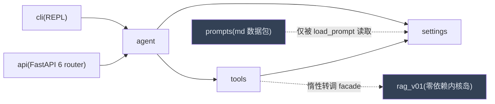

# TaskForce 架构总览

> 现有项目架构的成文介绍(2026-09-23 架构整理 c1-c8 落地后)。
> 领域术语一律见根目录 `CONTEXT.md`;进度、契约归属与契约变更登记见 `docs/dev/ROADMAP.md`;架构决策见 `docs/adr/`;文档目录索引见 `CLAUDE.md` 文档体系表。

## 1. 一句话定位

基于 LangGraph 的**单用户本地 Agent 工作台**:知识库问答 + 联网调研 + 沙箱代码执行,CLI 与 FastAPI 双入口共用同一业务层;控制面在本地,执行沙箱是远程自建 Docker 服务。

## 2. 代码布局与依赖方向

`src/` 下七个顶层包,**依赖单向无环**(`prompts` 与 `rag_v01` 是两个特例):



| 包 | 职责 | 依赖约束 |
|---|---|---|
| `agent/` | 主图、子图、契约(`contracts/`)、业务层 `service.run_turn` | → `settings`、`tools` |
| `tools/` | 内置文件工具、skills、mcp、sandbox、websearch、`rag/kb_search` 适配层 | → `settings` |
| `settings/` | config、loader(提示词渲染)、usage、session、db(checkpointer/store)、`embeddings` | 不依赖其他项目包 |
| `prompts/` | 全部提示词 md,`$name` 占位符(string.Template) | **零代码零依赖** |
| `api/` | FastAPI 入口(端口固定 8010) | → `agent` |
| `cli/` | 终端 REPL 入口 | → `agent` |
| `rag_v01/` | 知识库 RAG 内核(Milvus 双路 RRF、docling 解析、父子分块) | **零项目依赖**:不 import 任何项目包,只读 `RAG2_` 前缀环境变量,整体可拷走 |

- **契约唯一出处**:`Route`/`Task`/`TaskContract`/`ResultSummary`/`SubgraphContract`/挂起载荷与前缀常量全部在 `agent/contracts/`,其他包一律 import;改契约先在 ROADMAP §7 登记(§6 是归属表)。
- `kb_search` 与两个入口对 `rag_v01` 的依赖都是**函数体内惰性 import**,顶层 `import rag_v01` 无任何重依赖副作用。

## 3. 双入口与业务层

- CLI(`cli/repl.py`)与 FastAPI(`api/routers/chat.py`)只调同一套 `build_graph()` / `run_turn()`(`agent/` 包),不存在第二套实现。
- **全同步**:禁止 async/await;FastAPI 端点一律 `def`(线程池),SSE 用同步 generator + `queue.Queue` + worker 线程边跑边推,LangGraph 用 `graph.stream` 同步 API。
- `run_turn` 负责单轮驱动:messages 流逐 token 回调、updates 流抓路由轨迹与 interrupt,兜底 `GraphRecursionError`(打 `taskforce_error` 标记供 SSE 发 error 帧)。

## 4. 主图:六节点 + Send 派发

```mermaid
flowchart TD
    S[supervisor 结构化路由] -->|"answer"| A[answer 汇总作答]
    S -->|ask| ASK[ask 问询·interrupt]
    S -->|memory| MEM[memory 记忆·显式直写或 interrupt]
    S -->|dispatch| TM[TaskManager 后台线程·方案 A]
    S -.->|"Send 同步备胎(tasks=None·ADR-0009)"|.-> FAN
    TM --> FAN["Send fan-out:retriever / research / executor"]
    FAN --> S
    ASK --> S
    classDef dark fill:#334155,color:#e2e8f0
    class TM dark
```

- supervisor 是**唯一叙事者**与结构化路由者(`Route` schema,失败回退 answer);`subagent_results` 用 `operator.add` 合并,answer 消费即清。
- **异步派发(方案 A)**:dispatch 提交 `TaskManager` 后台线程池(并发上限 3),结果由 supervisor 每轮 `drain_done()` 回收注入;同步 Send 通道保留为备胎(ADR-0009 双通道)。
- **子图装配唯一出处**(c7):`agent/subagents/registry.get_subgraph(llm, agent)` 按 llm 强引用缓存、按 agent 惰性编译——`build_graph` 直挂与 `TaskManager` 后台 invoke 取**同一批**编译实例,消除双份装配与双倍 MCP 冷启动。
- 防失控双层:子图自数 `max_iterations` + 主图 `recursion_limit` 40 兜底(`ReplContext.graph_config`)。

## 5. 子智能体

- 三个子图:`retriever`(知识库检索)、`research`(联网调研)、`executor`(沙箱执行),共享 ReAct 骨架 `agent/subagents/react.py`(ADR-0010)。
- **任务契约四件套**(task / user_utterance / input_data / output_schema_hint)由 `build_contract()` 装配,经 Send payload 直达子图;子图不读主图 messages、不知彼此存在、不直接 `interrupt()`(缺信息在结果摘要 `needs_clarification` 标注)。
- 工具三层:内置(`tools/tool/`,操作沙箱工作区)+ Skills(`tools/skills/`,渐进加载)+ MCP(`tools/mcp/`,索引常驻、失败降级),装配在 executor:
  - `build_executor_graph(llm, tools=None)`(c3):缺省才装配一次真实工具集,提示词 meta 与 bind_tools 同源;测试直接注入假工具。
- 检索工具 seam(c6):`make_kb_search(search_backend)` 工厂,`retriever.build_retriever_graph(llm, search_backend=None)` 显式注入;工具名 `kb_search` 与 ToolMessage JSON 五键契约(`doc_id/filename/seq/content/score`)冻结——提示词写死了工具名;去重键 `(doc_id, seq)` 的定义收编在 `tools/rag/kb_search.hit_key` 单一出处。

## 6. HITL 与挂起载荷契约

- **单一挂起点**(ADR-0008):interrupt 只发生在主图 `ask`(问询)与 `memory`(确认写入)节点,任意时刻至多一个挂起;`/confirm yes|no`、`POST /chat/confirm|answer` 是恢复入口。
- **挂起载荷 kind 契约**(c5,`agent/contracts/interrupt_payload.py`):载荷自描述 `{"kind": "ask"|"memory", "text": ...}`,构造器 `ask_payload/memory_payload`,识别器 `classify_interrupt`——kind 优先、兼容旧检查点 question/proposal 键名形状、未知给 `unknown` 不静默;双入口直读 kind 分发,未知挂起在 REPL 显式告警(不再静默落入问询)。
- **合成消息前缀单一出处**: `[用户回答]:` / `子智能体结果已回收` / `(系统通知)`(`PREFIX_*` 常量 + `SYNTHETIC_USER_PREFIXES`),生产者(ask/supervisor/service)与历史回填过滤(api/chat)全部 import 常量,禁止写字面量。

## 7. 记忆双层

- **短期记忆** = checkpointer(按 `thread_id` 会话线程,PostgresSaver 连接池),跨重启可用。
- **长期记忆** = Store + pgvector,仅存用户事实与偏好;namespace 单一出处 `MEMORY_NS = ("memory", USER_ID)`(c4)。
- `agent/memory_ctx` 是记忆上下文单点:固定 system 的 `agents.md` 读入 + 记忆工具化(`memory_search`/`store_memory`,ADR-0011)+ 管理查询(`list_memories`/`delete_memory`,API `/memory` 与 REPL `/memory` 双入口纯渲染,c4)。
- 写入双路径(ADR-0002):显式要求→直写 `source=explicit`;自主提案→interrupt 确认后写 `source=confirmed`。
- **embedding 双路独立**:`settings/embeddings.py`(智谱,服务长期记忆;c2 自 tools 下沉,消除 settings→tools 反向循环)与 `rag_v01/embed.py`(百炼,服务知识库)。

## 8. 知识库 RAG(rag_v01)

- facade(`src/rag_v01/__init__.py`)两类入口,全部函数体内惰性 import:
  - 检索面:`ingest` / `search`(双路 top-20 召回 + RRF)+ `evaluate`(ragas,独立 eval 环境);
  - 管理面(c4 收编):`list_docs` / `upload`(20MB 上限、判重快照、带原名临时落盘、created 判定)/ `delete_doc`(不存在返 False,404 文案归入口)/ `MAX_UPLOAD_BYTES`——api 与 cli 双入口只做状态码与渲染,语义零重复。
- `doc_id` 内容寻址(文件字节 sha256 前 16 位),重复上传 `created=false`;`created_at` 恒 null。
- 语料唯一口径 `data/rag2_samples/`(c8:包内语料迁出,`src/rag_v01/` 纯代码;生成物已入 `.gitignore`)。

## 9. 基础设施(settings)

| 模块 | 职责 |
|---|---|
| `config.py` | `Settings` 单例 + 启动断言(LLM/Embedding/DB/沙箱) |
| `loader.py` | `load_prompt(name, **slots)`:读 md + `string.Template` 渲染 |
| `embeddings.py` | 智谱 embedding 客户端 + 维度探针(c2 下沉) |
| `usage.py` | `UsageTracker` 打点(/stats、SSE usage 帧) |
| `session.py` | `SessionStore`(thread_id 本地持久化) |
| `db/checkpointer.py` | PostgresSaver 工厂 + 会话列表 SQL |
| `db/store.py` | 长期记忆 Store 工厂:`get_store(database_url, embed=None)` 可注入向量化(c2) |

## 10. 测试与质量基线

- 两套测试:`tests/` 主线(随模块落地,Claude 维护)、`src/rag_v01/tests/` 内核独立套(203 项)。
- **注入 seam 约定**(架构整理后统一):依赖用工厂/可选参数显式注入(`make_kb_search`、`build_executor_graph(tools=)`、`get_store(embed=)`、`build_retriever_graph(search_backend=)`,均经 registry 单点装配),测试传假件;**禁止**裸赋值/monkeypatch 模块私有符号(曾实测假件泄漏带红其他用例)。
- 验收命令:`uv run pytest -q`(远程沙箱 2 条真实用例不可达时失败属已知外部依赖)、`uv run pytest src/rag_v01/tests -q`、`uv run ruff check .`。

## 11. 架构不变量(改代码前必读)

1. **全同步**:任何位置禁止 async/await。
2. **契约唯一出处** `agent/contracts/`;签名/字段变更先登记 ROADMAP §7。
3. **依赖单向**:cli/api → agent → {settings, tools};tools → settings;prompts 零依赖;rag_v01 零项目依赖。
4. **双入口共用业务层**:`build_graph`/`run_turn` 唯一,管理语义在 facade/memory_ctx 单点,入口只做渲染。
5. **提示词外置**:只在 `prompts/*.md`,经 `load_prompt` 渲染,禁止内联节点代码。
6. **HITL 单一挂起点**:interrupt 只在 ask/memory,载荷必须走 kind 契约。
7. **子图只经 registry 装配**:直挂与后台同批实例,禁止旁路再编译。
8. **并行纪律**:Send 分支各自取 psycopg 连接;子图绝不 `interrupt()`。
9. **端口固定**:后端 8010,8000 永远是沙箱隧道。
