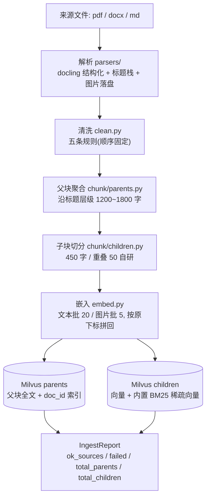
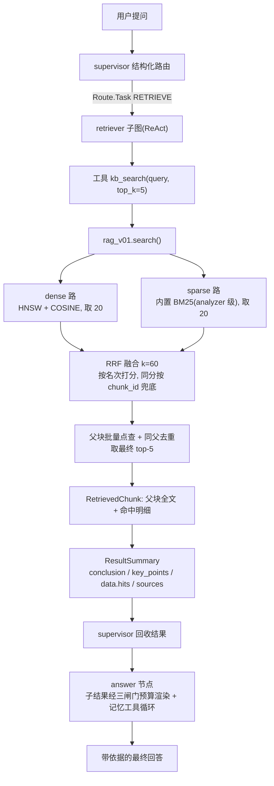

# 00-全链路总览

> 一句话: 先把这条链子摆在桌面上 —— 用户上传的文件怎么变成可检索的库, 一句提问怎么变成带依据的回答, 以及每一段的证据落在哪里。
> 对应实现: `src/rag_v01/`(内核) + `src/tools/rag/kb_search.py`(适配层) + `src/agent/subagents/retriever.py`(检索子智能体) + `src/agent/answer.py`(终答)
> 前置: 无(本篇是入口) | 下游: [01-设计构思](./01-设计构思与关键选型.md) / [02-入库侧](./02-入库侧全链路.md) / [03-检索侧](./03-检索侧全链路.md) / [04-生成侧](./04-生成侧全链路.md) / [05-质量检验](./05-质量检验策略与方法.md)
> 证据: `eval_reports/eval_rag_v01_20260922-170437.{json,md}`(基线) / `eval_reports/eval_tools_rag_v1_20260922-203552.{json,md}`(旧系统对照) / `src/rag_v01/tests/`(203 项)

## 一、这套文档讲什么

知识库这条线在 TaskForce 里只占一格: 用户上传文档 → 存进库里 → 问答时检索出相关段落 → 交给主智能体作答。但它内部是一条**五段流水线 + 两层检索 + 一层生成**, 每段都有自己的契约、参数与失败语义。本套讲解按这条链子分层展开, 每篇只讲一层:

| 篇 | 回答的问题 | 一句话结论 |
|---|---|---|
| [01-设计构思与关键选型](./01-设计构思与关键选型.md) | 为什么是这套技术栈? 备选是什么? | 六个选型都由"单用户 + 本地 + 可解释 + 低成本"这组约束倒推出来 |
| [02-入库侧全链路](./02-入库侧全链路.md) | 一个 pdf 从字节到落库经历了什么? | 解析→清洗→父子分块→嵌入→双集合落库, 逐文件隔离失败 |
| [03-检索侧全链路](./03-检索侧全链路.md) | 一句 query 怎么变成父块上下文? | 双路各取 20 → RRF(k=60) → top-5 → 父块回溯 → 同父去重 |
| [04-生成侧全链路](./04-生成侧全链路.md) | 检索结果怎么变成最终回答? | 检索子智能体的结果摘要经三闸门预算渲染进 answer 的消息流 |
| [05-质量检验策略与方法](./05-质量检验策略与方法.md) | 凭什么说它"好"? | 四层证据: 纯函数单测 / fake 集成 / 真机冒烟 / ragas 量化 + 新旧双跑 |
| [06-评估工程实现](./06-评估工程实现.md) | 评估本身怎么跑起来? | 两段式: 先产中间产物 jsonl, 再喂 ragas; ragas 装在独立环境 |
| [07-技术细节与坑位手册](./07-技术细节与坑位手册.md) | 哪些地方一不留神就静默出错? | 25 条细节, 每条都是"错了不报错"的类型 |
| [08-调参与容量手册](./08-调参与容量手册.md) | 想调质量该动哪个旋钮? | 先动候选深度与分块尺寸, `ef` 实测不敏感; 三类改动必须重灌 |

阅读路径见 [rag/README.md](../README.md) §二。

## 二、系统边界

```text
用户 / 前端
    │  上传文件
    ▼
┌──────────────────────────────────────────────────────────┐
│ 入口层: cli/commands/knowledge.py(REPL /kb)              │
│         api/routers/knowledge.py(GET|POST|DELETE)        │
└───────────────────────┬──────────────────────────────────┘
                        │ ingest([path]) / store.list_docs / store.delete_doc
                        ▼
┌──────────────────────────────────────────────────────────┐
│ src/rag_v01/  ← 知识库内核(零项目依赖, 可整目录搬走)      │
│   parsers → clean → chunk → embed → store               │
│   retrieve(检索) / evaluation(评估) / cli(命令行)        │
└───────────────────────┬──────────────────────────────────┘
                        │ search(query) -> list[RetrievedChunk]
                        ▼
┌──────────────────────────────────────────────────────────┐
│ src/tools/rag/kb_search.py  ← agent 侧适配层              │
│   工具名 kb_search, JSON 契约 doc_id/filename/seq/content/score │
└───────────────────────┬──────────────────────────────────┘
                        ▼
┌──────────────────────────────────────────────────────────┐
│ agent 侧: retriever 子图(ReAct) → ResultSummary → answer  │
└──────────────────────────────────────────────────────────┘
```

三条边界要记住:

1. **内核不 import 项目任何包**(`agent/`、`tools/`、`settings/`), 只依赖第三方库与自己的 `config.py` —— 这是它"能整目录搬走"的前提, 也是它不读 `.env`(靠 `RAG2_` 环境变量)的原因。
2. **工具契约由接收方定**(`agent/subagents/retriever.py:29-47` 的 `_collect_hits` 按 `(doc_id, seq)` 去重), 所以适配层的五个字段一个都不能少, 冗余字段也不能随手加。
3. **agent 只认 `RetrievedChunk`**, 不碰 Milvus、不碰 `store.py` 内部结构; 反过来内核也不知道 agent 的存在。

外层 Agent 编排(路由/子图/记忆/HITL)不在本套文档范围内, 见 [AGENTS.md](../../../../AGENTS.md) §7 与 [docs/DESIGN.md](../../../DESIGN.md)。

## 三、端到端两条链路

### 3.1 入库链路(写路径)



要点: **逐文件处理**(不把整批文档留在内存里)、**单文件失败隔离**(进 `failed` 继续跑下一篇)、**同源旧版本清理**(`purge_stale` 在写入之前)。细节见 [02 篇](./02-入库侧全链路.md)。

### 3.2 问答链路(读路径)



两条路径的**生成侧**不一样, 别混:

| | 线上(agent 主链路) | 评估(`evaluation.py`) |
|---|---|---|
| 谁生成 | `agent/answer.py` 的 `answer_node` | `simple_answer()`(`evaluation.py:142-165`) |
| 上下文来源 | 子智能体结果摘要里的 `data.hits`, 经 `_render_evidence` 三闸门截断 | 直接拿 `RetrievedChunk.parent_text` 全量列表 |
| 是否带记忆/技能/背景 | 带(注入 `agents.md`、可调记忆工具) | 不带, 单一固定 prompt |
| 目的 | 回答用户 | **把生成端变量压到最小**, 让指标变化主要反映检索质量 |

评估侧为什么故意用"笨"生成器, 见 [05 篇](./05-质量检验策略与方法.md) §三。

## 四、契约面速查

内核对外只承诺**三个函数 + 四个类型**([07 篇方案 §4.1](../../../new_module/rag_0.1/07-接口设计与移植方案.md), 实现见 `src/rag_v01/__init__.py`):

| 契约 | 位置 | 说明 |
|---|---|---|
| `ingest(paths) -> IngestReport` | `__init__.py:27` | 批量入库, 文件或目录(递归) |
| `search(query, top_k=None) -> list[RetrievedChunk]` | `__init__.py:34` | `top_k=None` 走 `RAG2_RETRIEVE_TOP_K` |
| `evaluate(testset, report_dir, ...) -> EvalReport` | `__init__.py:44` | 需要 ragas, 只在评估环境可用 |
| `ParsedDoc` / `ParentChunk` / `ChildChunk` | `contracts.py:42/86/90` | 入库侧中间产物(不对外, 供测试与排障) |
| `ChildHit` / `RetrievedChunk` | `contracts.py:94/111` | 检索侧结果;**`RetrievedChunk` 是唯一跨包契约** |
| `IngestReport` / `EvalReport` | `contracts.py:130/141` | 两次调用的返回值, 只留程序要用的最小面 |

`import rag_v01` **无副作用**: 三个入口在函数体内按需 import 子模块, 所以导入这个包不会拉起 docling / pymilvus / torch, 不连库、不建目录(`tests/test_cli.py` 用子进程断言 `heavy=[]`)。

## 五、关键参数速查

全部来自 `src/rag_v01/config.py`(`RAG2_` 前缀环境变量, 变量名 = `RAG2_` + 字段名大写), `.env` 目前只覆盖了其中 7 项:

| 环节 | 参数 | 默认值 | 影响面 |
|---|---|---|---|
| 分块 | `parent_target_chars` | 1500(实际区间 1200~1800) | 生成侧上下文粒度、BM25 命中粒度 |
| 分块 | `child_target_chars` / `child_overlap_chars` | 450 / 50 | 召回粒度与同父合并效果 |
| 检索 | `candidate_top_n` | 20 | 每一路进融合的候选数(实测最敏感) |
| 检索 | `retrieve_top_k` | 5 | 最终进模型的父块数 |
| 检索 | `rrf_k` | 60 | 融合平滑常数(名次差被压缩的程度) |
| 检索 | `hnsw_ef` | 96 | 查询期搜索宽度(实测 64/96/128 结果一致) |
| 嵌入 | `embed_dim` | 1024 | 改它必须重建 collection |
| 嵌入 | `embed_batch` / `embed_img_batch` | 20 / 5 | 百炼 API 单请求上限 |
| 落库 | `milvus_uri` | `http://localhost:19530` | WSL docker 里的 Milvus |
| 评估 | `judge_model` 等 | 由 `.env` 给(`deepseek-flash`) | 既当 judge 也当评估生成器 |

`.env` 里实际生效的 7 项: `RAG2_EMBED_MODE=api`、`RAG2_EMBED_DIM=1024`、`RAG2_EMBED_BATCH=20`、`RAG2_EMBED_IMG_BATCH=5`、`RAG2_MILVUS_URI`、`RAG2_JUDGE_MODEL`、`RAG2_JUDGE_API_BASE`。其余用默认值。

调参顺序与实测结论见 [08 篇](./08-调参与容量手册.md)。

## 六、当前库里的实际数据

| 项 | 值 | 来源 |
|---|---|---|
| 文档数 | 499 | `store.list_docs()` 实测 |
| 子块数 | 597 | 同上 |
| 语料 | DuReader-Robust 抽样 500 段 | 入库 500 篇会得到 499 份文档 —— 有 2 篇同内容被**内容寻址**合并(见 [02 篇](./02-入库侧全链路.md) §六) |
| 入库耗时 | 1m59s(500 篇) | 基线执行记录 |

注意: 这份语料是**评估语料**, 一段一个文件、段落中位 215 字, 所以"1 文档 = 1 父块", 父子分块里"多子块/跨页/同父去重"的能力**没有被它覆盖**(见 [05 篇](./05-质量检验策略与方法.md) §四)。

## 七、证据索引(每个结论落在哪)

| 结论 | 证据 | 位置 |
|---|---|---|
| 四指标基线 | 上下文精度 0.8958 / 召回 0.9500 / 忠实度 0.9595 / 相关度 0.5015 | `eval_reports/eval_rag_v01_20260922-170437.md` |
| 重跑复现性 | 检索侧 Δ≤0.003, 生成侧 Δ0.028~0.048 | `eval_reports/eval_rag_v01_rerun_20260922-180435.md` |
| 新内核优于旧内核 | 精度 0.6896 → 0.8958(**+0.206**, 唯一明确超出噪声带的项) | `eval_reports/eval_tools_rag_v1_20260922-203552.md` |
| 文本/图片同向量空间 | `cos(图, 相关文)=0.7444 > cos(图, 无关文)=0.2282` | [04 篇与旧方案](../../../new_module/rag_0.1/04-嵌入与Milvus索引.md) §五 |
| 切分器与 RRF 正确性 | 手算 `1/(60+r_d)+1/(60+r_s)` 与实现逐条相等 | `src/rag_v01/tests/test_retrieve.py` |
| 父子分块能力(多子块/跨页/空壳标题) | 单测 21 项 + 真 pdf 人工实测(15 页/156 条目/页码全覆盖) | `src/rag_v01/tests/test_chunk.py`、[TODO 里程碑记录](../../../new_module/rag_0.1/TODO.md) |
| 无 import 副作用 | 子进程断言不加载 docling/pymilvus | `src/rag_v01/tests/test_cli.py` |
| 全链路可跑 | 全套件 402 passed / 2 failed(失败为远程沙箱不可达) | `uv run pytest -q` |

## 八、与其它文档的分工

- **方案为什么这么定、当时的骨架代码、与实现的出入** → [docs/new_module/rag_0.1/](../../../new_module/rag_0.1/00-总览.md)(本篇只引用, 不复制)
- **进度与决策流水(按日期)** → [rag_0.1/TODO.md](../../../new_module/rag_0.1/TODO.md) 的变更登记
- **契约归属与变更纪律** → [ROADMAP §6/§7](../../../dev/ROADMAP.md)
- **术语(会话线程、任务契约、结果摘要…)** → [CONTEXT.md](../../../../CONTEXT.md)
- **外层多智能体架构** → [AGENTS.md](../../../../AGENTS.md) §7、[docs/DESIGN.md](../../../DESIGN.md)
