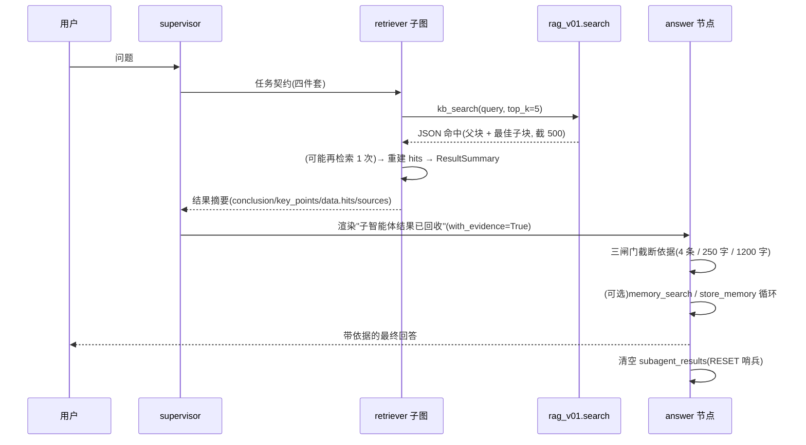

# 04-生成侧全链路

> 一句话: 检索只是把材料找出来, 真正的回答由**主智能体的 answer 节点**生成 —— 材料经"结果摘要 → 三闸门预算 → 消息流"三段才进模型, 中间任何一段塞多了都会挤掉别的信息。
> 对应实现: `src/agent/subagents/retriever.py`(检索子智能体) + `src/agent/answer.py`(终答) + `src/prompts/subagents/retriever.md`、`src/prompts/answer.md`
> 前置: [03-检索侧全链路](./03-检索侧全链路.md) | 下游: [05-质量检验策略与方法](./05-质量检验策略与方法.md)
> 证据: `tests/test_retriever.py`(9 项) / `tests/test_graph.py`(33 项) / `agent/answer.py:26-29` 的三个预算常量

## 一、先分清两条生成路径

这套系统里有**两个生成器**, 用途完全不同, 混起来讲必错:

| | 线上生成(agent 主链路) | 评估生成(`evaluation.py`) |
|---|---|---|
| 入口 | `answer_node`(`agent/answer.py:121-139`) | `simple_answer()`(`evaluation.py:142-165`) |
| 上下文来源 | 子智能体结果摘要里的 `data.hits`, 经三闸门截断 | 直接把 `RetrievedChunk.parent_text` 列表全量塞进去 |
| 系统提示词 | `prompts/answer.md` + 注入 `agents.md`/技能/MCP/沙箱元信息 | 一段固定 prompt, 无注入 |
| 能否调工具 | 能(`memory_search` / `store_memory`) | 不能 |
| 目的 | 给用户一个能用的回答 | **把生成端变量压到最小**, 让指标变化主要反映检索质量 |

评估侧为什么故意用"笨"生成器: 如果评估时用的生成器和线上一样复杂, 那么指标一动你就分不清是**检索变好了**还是**生成提示词变了**。固定 prompt + `temperature=0` 是给"检索质量"做的隔离变量, 详见 [05 篇](./05-质量检验策略与方法.md) §三。

## 二、检索子智能体: 一次"带工具的问询"

### 2.1 ReAct 循环与私有上下文

检索不是一次函数调用, 而是一个**可以多轮调工具的子智能体**(`agent/subagents/retriever.py`, 骨架在 `agent/subagents/react.py`): `agent → tools → agent → … → finalize`。三个关键约束:

- **`MAX_ITERATIONS = 5`**(`retriever.py:24`): 每一轮约 2 个 super-step, 主图的 `recursion_limit` 是兜底。提示词里给模型的纪律更严(**最多两次检索**), 代码留的余量更宽 —— 提示词管方向, 上限管失控。
- **上下文预算闸门**: `CONTEXT_BUDGET_CHARS = 16000`(`react.py:30`)。超了就注入 `WRAPUP_HINT` 要求收尾 —— 因为工具返回的父块全文可能很长, 多轮下来会把子图自己的上下文撑爆。
- **私有消息键必须叫 `react_msgs`**(`react.py:39`): 共享键直挂模式下, 如果子图也用 `messages` 这个名字, 子图的 ToolMessage 会**并进主图历史**, 主图上下文立刻被检索原文污染。这是 ADR-0010 的一条红线。

### 2.2 收尾: 三种状态 + 零额外 LLM 调用

`build_summary`(`retriever.py:54-90`)按优先级判断:

| 状态 | 判据 | 为什么要这么判 |
|---|---|---|
| `partial` | 最后一条消息**仍然带 `tool_calls`** | 说明模型还想调工具但被轮数上限截停, 诚实返回不完整结果 + warning |
| `need_clarification` | `_collect_hits` 为空 | **不调 LLM**, 直接返回"知识库未检索到相关内容" —— 没材料时让模型自由发挥是最危险的动作 |
| `success` | 有命中 | 解析模型最后一条消息拿到结论与要点, 并把命中明细放进 `data.hits` |

**为什么 finalize 不再发起第二次 LLM 调用**: 早期设计是让 finalize 用 `with_structured_output` 把模型的自由文本转成结构化摘要, 实测发现模型对 QA 型任务倾向**直接在 content 里自答**(不自答就违反"得出结论"的指令), 于是结构化解析普通文本会崩。改成"解析已有文本 + 确定性重建 hits"后: 零额外延迟、零额外成本、且结果稳定。

`_collect_hits`(`:29-47`)是确定性重建的关键: 遍历所有 ToolMessage, `json.loads` 失败或不是数组的**跳过**(工具错误提示就是普通文本), 跨调用按 **(doc_id, seq) 去重** —— 这个去重键正是适配层契约存在的理由。

### 2.3 结果摘要: 唯一回传通道

`agent/contracts/summary.py:18-38` 的 `ResultSummary` 是子智能体与主图之间**唯一**的接口:

| 字段 | 约束 | 说明 |
|---|---|---|
| `agent` / `task_id` / `task` | — | 身份与任务回显 |
| `status` | success / partial / need_clarification / failed | 决定上层的处理分支 |
| `conclusion` | **≤100 字** | 决策字段, 上限保留(超长会被 validate 拦) |
| `key_points` | ≤5 条 | 要点 |
| `data` | retriever 填 `{"hits": [...]}` | **正文的唯一通道**: answer 节点从这里取原文 |
| `sources` | doc_id 去重后前 10 | 引用来源 |
| `needs_clarification` / `warnings` | — | 缺口与告警 |

注意"子智能体只回摘要、不回原文正文摘要之外的上下文"这个设计: 主图不可能把子图里检索到的几万字都塞进自己的历史, 所以**只回摘要 + 结构化 hits**, 由 answer 节点按预算二次取用。

## 三、主图回收与渲染

### 3.1 supervisor 侧

`agent/supervisor.py:82-91`: 有 `subagent_results` 时渲染成一条 `HumanMessage("子智能体结果已回收:\n" + _render_results(results))` 追加进消息流。两个细节:

- 默认 `with_evidence=False` —— **路由只看决策字段**(状态、结论), 不需要正文, 省 token。
- 异步派发(TaskManager)回收的结果**必须写回 state**(`:100-105`), 否则 answer 节点读到空结果。

### 3.2 结果渲染格式

`answer.py:79-95` 的 `_render_results` 用固定三键: `[i] agent=… | 任务:… | 结果:… | 澄清:… | 执行提示:…`, **不原文拼接**(子结果的结构化字段已经是摘要, 再叠一层格式只会浪费 token)。

### 3.3 answer 节点的三闸门预算

这是全链路**最容易讲错**的一段: 检索回来的父块可能很长(1500 字 × 5 条 = 7500 字), 直接塞进消息流会挤掉对话历史、技能说明与记忆。`answer.py:26-29` 用三个常量控制:

| 常量 | 值 | 作用 |
|---|---|---|
| `EVIDENCE_ITEMS_MAX` | 4 | 最多取几条依据 |
| `EVIDENCE_ITEM_CHARS` | 250 | 单条依据正文上限 |
| `EVIDENCE_TOTAL_CHARS` | **1200** | 全部依据的**总**上限(硬闸门) |
| `SOURCES_MAX` | 5 | 来源列表上限 |

`_render_evidence`(`:37-76`)对不同子智能体给不同格式: retriever 的 `hits` 渲染成 `《filename》#seq:content`, research 的 `results` 渲染成 `title(url):snippet`, 其它形状退化成 `k=v`。**先按条数截, 再按单条截, 最后按总量截** —— 三层依次收紧, 保证总预算永远不破。

### 3.4 记忆工具循环与 RESET 哨兵

`_answer_with_memory`(`:98-118`): answer 节点绑定 `memory_search` / `store_memory`, 循环上限 `MEMORY_LOOP_MAX = 4`(`:22`)。工具消息**只进本轮 messages, 不写回 state** —— 因为固定前缀(系统提示词 + agents.md)要保持稳定以命中前缀缓存, 中间插进来的工具往返不能污染它。

另一个必须知道的反直觉点: **answer 节点返回 `subagent_results: [RESET]` 而不是 `[]`**(`:139`)。因为该键的 reducer 是 `operator.add`, **加空列表等于没加**, 清不掉上一批结果; `state.py:17-21` 定义了一个哨兵对象, 只有它能让 reducer 真的重置。这是"读代码时看不出、但删了就会串台"的一处设计。

## 四、一次问答的完整时序

## 五、提示词侧的纪律(为什么这些规则必须写死)

`prompts/answer.md` 与 `prompts/subagents/retriever.md` 里的规则不是"风格偏好", 每条都对应一类失败:

| 规则 | 防的是什么 |
|---|---|
| 只依据命中内容回答, 禁用外部知识 | 检索为空时模型用内部知识编答案 —— 最坏的一类失败(用户以为是查到的) |
| 结论 ≤100 字 / 要点 ≤5 条 | 摘要是给主图读的, 膨胀会挤掉别的东西 |
| 复合问题必须拆成多条查询 | 一次 query 混两个主题, 两路召回都会被稀释 |
| 首轮命中相关就收尾, 禁止换词重搜 | 反复检索烧钱且不增信息量(提示词给 2 次上限, 代码给 5 轮) |
| 冲突必须明示 | 多来源矛盾时把矛盾讲出来, 而不是挑一个答 |
| 澄清项非空必须追问 | 子智能体报了 `need_clarification`, answer 不能假装没看见 |
| 涉及"我/我的"先 `memory_search` | 个人相关的问题先查长期记忆, 而不是问用户 |

**提示词一律放 `prompts/` 下的 md 文件**, 经 `settings/loader.py` 的 `load_prompt(name, **slots)` 渲染; 占位符用 `$name`(`string.Template`)而不是 `{name}` —— 因为提示词里含 JSON 花括号, `str.format` 会崩。固定 system 只放静态内容(前缀缓存), 动态内容走消息流。详细设计见 [docs/PROMPT-DESIGN.md](../../../PROMPT-DESIGN.md)。

## 六、生成侧的质量边界(它保证不了什么)

诚实说明这条链路的局限, 比吹它能干什么更有用:

1. **它不保证答案正确**, 只保证"基于检索到的材料作答"。材料错了, 回答照样错(评估里 faithfulness 高而 relevancy 低, 就是这个形态)。
2. **它不保证覆盖全部材料**: 三闸门截断意味着第 4 条之后的依据根本不进模型 —— 如果答案在第 5 个父块里, 模型看不到。
3. **它不保证引用准确**: `sources` 是 doc_id 列表, 模型在实际行文里引用哪一条由它自己决定, 目前没有做引用级校验。
4. **评估生成器与线上生成器不是同一个**, 所以 ragas 指标衡量的是"检索 + 简单生成"这条链, 不是线上回答质量的全部。这条限制写在 [05 篇](./05-质量检验策略与方法.md) §六里。

## 七、本篇自查清单

- [x] 两条生成路径的对照表在前(避免与评估生成器混淆)
- [x] ReAct 三个约束(轮数 / 字符预算 / 私有键)都写了理由
- [x] 三种收尾状态的判据与"不调 LLM"的理由都在
- [x] 结果摘要字段表标了哪些是硬约束、`data.hits` 为什么是唯一正文通道
- [x] answer 三闸门预算给了具体数值与"三层依次收紧"的顺序
- [x] RESET 哨兵这种反直觉设计单独说了
- [x] 提示词纪律逐条对应失败类型
- [x] 写了生成侧保证不了什么(边界诚实)

下一步: [05-质量检验策略与方法](./05-质量检验策略与方法.md)。
