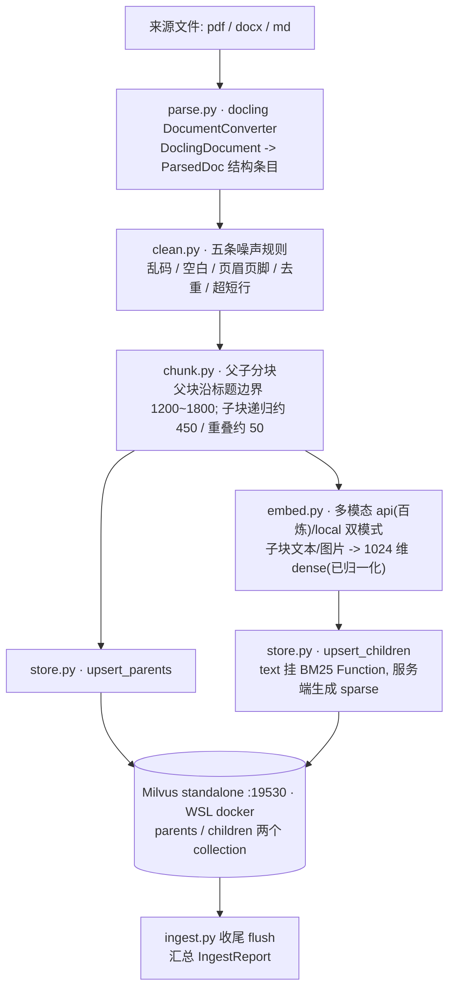
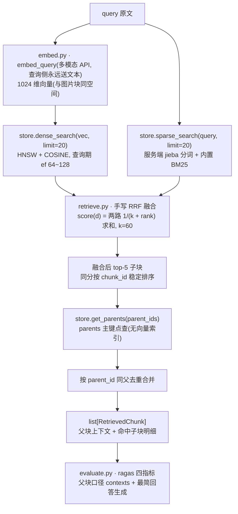

# 00-总览

> **【现行 · 唯一口径 · 2026-09-23】** 知识库 RAG 的现行方案以本套 9 篇为准;历史方案(docs/improved/)已全部加失效横幅。
> 一句话: 用 docling 结构化解析 + 父子分块 + Milvus(HNSW 向量 + 内置 BM25 稀疏)双路检索 + ragas 量化评估, 在 `src/rag_v01/` 重建一条**可整体移植**的知识库 RAG 链路。
> 本套文档共 9 个文件(00~07 + [TODO.md](./TODO.md)); 所有字段名、参数值以本套文档为唯一口径, 与旧系统 `src/tools/rag/` 无关。
> 本次只产出方案文档, 不写任何代码; 落地时业务代码由用户亲手誊写(智能体给完整代码 + 改动点清单), `tests/` 测试由智能体编写维护。

## 一、模块目标与边界

### 1.1 目标(对应四条原始需求)

| # | 需求 | 落点 |
|---|---|---|
| 1 | pdf / docx / md 三种格式, 内容含表格与图片 | [./02-文档解析与噪声处理.md](./02-文档解析与噪声处理.md) |
| 2 | docling 解析 + 噪声处理 + 结构感知父子分块 + chunk 元信息 + Milvus(HNSW) + embedding 选型 | 02 / [./03-父子分块策略.md](./03-父子分块策略.md) / [./04-嵌入与Milvus索引.md](./04-嵌入与Milvus索引.md) |
| 3 | BM25 + 向量混合索引(混合候选 top-20)+ RRF 融合(最终 top-5) | [./05-混合检索与RRF融合.md](./05-混合检索与RRF融合.md) |
| 4 | ragas 量化评分 | [./06-ragas评估.md](./06-ragas评估.md) |
| — | 环境、依赖、Milvus 部署、`RAG2_` 配置 | [./01-环境与依赖.md](./01-环境与依赖.md) |
| — | 适配性 / 可移植进现有 agent | [./07-接口设计与移植方案.md](./07-接口设计与移植方案.md) |

三条贯穿全篇的硬约束(各分篇逐字遵守):

1. **零项目依赖**: 不 import `agent/`、`tools/`、`settings/` 任何包, 配置只读 `RAG2_` 前缀环境变量, 目录整体拷走即可用(07 篇);
2. **全同步**: 禁止 async/await, pymilvus / ragas / docling 一律走同步 API;
3. **契约唯一出处**: 全部数据契约只在 `contracts.py` 用 dataclass 定义, 其它模块一律相对 import(与主项目 `agent/contracts/` 的纪律同构)。

### 1.2 边界(不做什么)

- **不改旧系统**: `src/tools/rag/`、`docs/improved/` 下任何文件不动——旧链路全程保持可运行, 是移植期的回滚依托(07 篇);
- **本次不写代码**: 只产出本目录下的 md 文档; pyproject extra / docker compose / `.env` 段 / `.py` 一律留到落地阶段;
- **不做 rerank 模型、查询改写、多轮对话整合(memory)**: 检索链路的边界见 05 篇, agent 集成属 07 篇移植期的事;
- **不做数据迁移**: 旧库(pgvector + 智谱向量)与新库(Milvus + 百炼 embedding)向量空间不同, 移植期按"重新入库"处理(07 篇 §4.6 步骤 3)。

### 1.3 目录结构(代码与文档, 定稿)

```text
src/rag_v01/
  __init__.py    对外 facade: ingest / search / evaluate 三入口
  config.py      独立配置: 读 RAG2_ 前缀环境变量
  contracts.py   数据契约: ParsedDoc / ParentChunk / ChildChunk / RetrievedChunk / IngestReport / EvalReport
  parse.py       02: docling 解析 pdf/docx/md -> ParsedDoc
  clean.py       02: 噪声处理
  chunk.py       03: 父子分块
  embed.py       04: embedding 双模式抽象
  store.py       04: Milvus 建表(HNSW+BM25)/upsert/查询/按 doc_id 删除
  retrieve.py    05: 双路 top-20 召回 + 手写 RRF top-5 + 父块回溯
  ingest.py      流水线编排: parse -> clean -> chunk -> embed -> store
  evaluate.py    06: ragas 评估与基线报告
  cli.py         命令行: ingest/search/evaluate 子命令
  tests/         模块内单测(fake embedding/monkeypatch, 不依赖真实 Milvus/LLM)
docs/new_module/rag_0.1/
  00-总览.md / 01-环境与依赖.md / 02-文档解析与噪声处理.md / 03-父子分块策略.md / 04-嵌入与Milvus索引.md / 05-混合检索与RRF融合.md / 06-ragas评估.md / 07-接口设计与移植方案.md / TODO.md
```

注: 新模块的**包名是 `rag_v01`**(源码目录 `src/rag_v01/`), 全项目按 `from rag_v01.parsers import ...` 使用 —— 原名 `rag_0.1` 带点号, 不能作为 Python 包名, 已于 2026-09-20 改名。2026-09-22 起它是**已安装的顶层包**: 与其它六个包同深度地登记进 `[tool.hatch.build.targets.wheel] packages`, `uv sync` 后 `import rag_v01` 直接可用(不再依赖 `pythonpath` 或 `PYTHONPATH`); 移植见 [07 篇](./07-接口设计与移植方案.md) §4.6。

### 1.4 怎么用这套文档

推荐顺序: 00(本篇) → 01(环境先立起来) → 02 → 03 → 04 → 05(链路打通) → 06(量化) → 07(接口与移植) → [TODO.md](./TODO.md)(进度指针)。每篇固定六节: 目标与边界 / 设计决策 / 数据流与契约 / 实现要点 / 验收清单 / 依赖关系; 落地时从 TODO.md 第一个未勾项继续。

## 二、设计决策与理由(含备选对比)

### 2.1 背景: 旧 rag_improve_v1 的四个结构性局限

旧系统 `src/tools/rag/` 是已收口的 BM25(jieba)+pgvector+RRF 双路融合 RAG([docs/improved/rag_improve_v1/TODO.md](../../improved/rag_improve_v1/TODO.md): 191 passed, 2026-09-14), 骨架值得保留, 但作为"知识库检索"的底子有四个局限(现状引自只读调研结论, 未运行验证):

| 局限 | 旧系统现状 | 新系统对应 |
|---|---|---|
| **无结构化解析** | `parse_document(path) -> str`(`src/tools/rag/parse.py:10`)只产出纯文本: 标题层级、页码、表格行列、图片全部丢失; chunk 元信息只有 filename/seq | docling `DocumentConverter` → `DoclingDocument` 结构树 → `ParsedDoc` 结构化条目(标题栈 / 表格 Markdown / 图片落盘 / page_no), 02 篇 |
| **无父子分块** | `split_text(text) -> list[str]`(`src/tools/rag/split.py:10`)固定 500/100 单层递归——"检索的块"与"喂模型的块"是同一份, 匹配精度与上下文完整只能两头凑合 | 父块 1200~1800 供上下文 + 子块约 450 / 重叠约 50 供召回, 命中后按 parent_id 回溯父块(03 / 05 篇) |
| **pgvector 单库** | 向量与 BM25 不在同一引擎: BM25 由进程内 rank_bm25 自算(`bm25.py:45`, 懒重建+脏标记); `RAGStore`(`store.py:45`)直连 `settings.database_url`/`db.get_conn`, 依赖项目基础设施, 整目录搬不走 | Milvus standalone 双 collection: children 的 `text` 挂内置 BM25 Function + jieba analyzer 生成 sparse, 与 dense(HNSW)同库同查; 零项目依赖(01 / 04 篇) |
| **无量化评估** | 旧 05-评测与回归只有 Recall@5 / MRR@5 检索指标(固定评测库 8 篇文档 9 条查询), 无生成侧指标, 回答不了"回答是否忠实于上下文" | ragas 四指标(context_precision / context_recall / faithfulness / answer_relevancy)+ TestsetGenerator 出题 + 人工校对 30~50 条 + json/markdown 基线报告(06 篇) |

另有两处"契约层"的历史包袱, 正是新系统收口的目标: `kb_search` 的 JSON 契约(`kb_search.py:25`)与 `RAGStore` 四方法面把 pgvector 实现细节泄漏成对外承诺; 且旧 `src/tools/rag/` 目前处于**半途重命名**状态(测试 monkeypatch 字符串已指 `tools.rag_0.1.kb_search`, 目录/import 仍是 `tools.rag`)——细节与处置见 [07 篇](./07-接口设计与移植方案.md) §4.5 与 §4.6 步骤 0。

### 2.2 为什么另建目录重写, 而不是原地升级

| 备选 | 结论 | 理由 |
|---|---|---|
| 在 `src/tools/rag/` 原地改(pgvector→Milvus、换 parse/split) | 弃 | 每一步都被旧契约绑住: 要兼容 `kb_search` JSON 与 `RAGStore` 四方法面; 旧系统正处半途改名分裂; 改完仍带 `settings/` 依赖, 搬不走——"可移植进现有 agent"的目标落空 |
| 引入现成 RAG 框架(LlamaIndex / LangChain 的 RAG 链) | 弃 | 解析/切块/检索被包成黑盒, 与"练手学 RAG"的教学目标冲突; 依赖面大, 与零依赖移植冲突; 旧系统已用过 langchain 切分器, 新模块刻意手写关键轮子 |
| **新建 `src/rag_v01/` 重写(选定)** | 采用 | 零项目依赖、可整目录拷贝(07 篇); 旧系统全程可运行, 移植前不动一行(回滚依托); 对外只承诺 facade 三入口 + 六契约, 实现随各分篇自由重构; 移植期"并行双跑、达标再切"(07 篇 §4.6) |

### 2.3 六项核心选型一览(含备选)

| 决策点 | 选定 | 一句话理由 | 主要备选与否决 | 详见 |
|---|---|---|---|---|
| 解析器 | docling `DocumentConverter` | 一套 `DoclingDocument` 同时给条目类型、标题层级、表格网格、图片、页码溯源 | pypdf+python-docx 手拼 / Unstructured / Marker | [02](./02-文档解析与噪声处理.md) |
| 切块策略 | 结构感知父块 + 递归子块(父子分块) | 匹配要小块、生成要大块, 拆开各自最优 | 固定窗口 / 单层递归 / 整篇不切 | [03](./03-父子分块策略.md) |
| 向量库与稀疏索引 | Milvus standalone(19530, WSL docker) | 内置 BM25 Function + jieba analyzer 让 sparse 与 dense 同库; 部署在 WSL 发行版内 docker; milvus-lite 官方不支持 Windows | pgvector 加列 / ES / Qdrant / milvus-lite | [01](./01-环境与依赖.md)/[04](./04-嵌入与Milvus索引.md) |
| Embedding | `qwen3-vl-embedding`(阿里云百炼**多模态** API, 指定 1024 维) | 文本与图片**映射到同一向量空间**: 图片块以真向量进 dense 路, 文本 query 可跨模态命中; 维度经 `dimension=1024(SDK 顶层参数)` 与 schema 对齐; DashScope SDK 接入(OpenAI 兼容端点不支持图片输入) | 纯文本时可等价替换 `qwen3.7-text-embedding-flash`(128K 上下文、更便宜, 但无图片向量); local 离线备选 `BAAI/bge-m3`(**纯文本**, 不支持图片向量) | [04](./04-嵌入与Milvus索引.md) |
| 融合 | 客户端手写 RRF, k=60 | 只吃名次、无量纲; 纯函数可单测; 中间名次全可见; 备胎(rank_bm25)切换时融合层不动 | 分数加权(量纲不可比)/ 原生 hybrid_search + RRFRanker(过程不可见) | [05](./05-混合检索与RRF融合.md) |
| 评估 | ragas 四指标 | 指标与链路两端一一对应; 自带出题器解决冷启动无标注数据 | 人工打分 / 自写规则指标 / DeepEval | [06](./06-ragas评估.md) |

## 三、数据流与接口契约

### 3.1 端到端数据流

**入库链路(ingest = parse → clean → chunk → embed → store)**:



**检索链路(search = 双路 top-20 → 手写 RRF k=60 → top-5 → 父块回溯去重)**:



两条边界的错误语义(05 篇 §4.3): 两路皆空时 `search` 返回 `[]`(确无相关内容); Milvus 连接类故障向上抛异常, 不吞。

### 3.2 对外接口: 包级 facade 只暴露三个入口

```python
ingest(paths: list[str | Path]) -> IngestReport
search(query: str, top_k: int = 5) -> list[RetrievedChunk]
evaluate(testset_path: str | None = None, report_dir: str = "./eval_reports") -> EvalReport
```

管理类操作(按 `doc_id` 删除、列文档)不进 facade, 由 `store.py` 直供、`cli.py` 直调(07 篇 §2.1)。

### 3.3 contracts.py 六类型与流向

| 契约类型 | 产出于 | 主要消费方 |
|---|---|---|
| `ParsedDoc` | 02 parse + clean | 03 chunk |
| `ParentChunk` / `ChildChunk` | 03 chunk | 04 embed / store |
| `RetrievedChunk` | 05 retrieve(经 facade `search`) | 06 evaluate; 07 篇移植期的适配层 |
| `IngestReport` | 07 篇 `ingest.py`(编排 02→03→04) | `cli.py`、人工排查 |
| `EvalReport` | 06 evaluate | `cli.py`、移植决策 |

字段细节以各分篇与落地时的 `contracts.py` 为准; 九字段元信息(`chunk_id, parent_id, doc_id, source, page_no, heading_path, chunk_type(text|table|image), char_len, created_at`)命名固定, 不得增删改名, 父块同样携带(其 `parent_id` 为空)。`Hit` / `ParentRow` 等模块内部结构不进 `contracts.py`(04 篇 §3.2)。

### 3.4 配置出口

全部配置只读 `RAG2_` 前缀环境变量, 由 `config.py` 统一读取, **不依赖 `settings/config.py`**: 基础表(Milvus 地址、embedding 双模式(`RAG2_EMBED_MODE` 默认 api, 百炼多模态 `qwen3-vl-embedding`; local 纯文本离线备选)、judge 三件套、分块与检索参数)见 [01 篇](./01-环境与依赖.md) §三; 各分篇补充项——`RAG2_EMBED_DIM`(本期固定 1024) / `RAG2_EMBED_BATCH`(单请求内容元素总数上限) / `RAG2_EMBED_IMG_BATCH`(图片分批上限) / `RAG2_HNSW_EF`(04 篇), `RAG2_DO_OCR` / `RAG2_IMAGE_DESC` / `RAG2_IMAGE_DIR` / `RAG2_IMAGE_FORMAT` / `RAG2_SHORT_LINE_MAX` / `RAG2_HF_GEOMETRIC`(02 篇)。另有两个"环境级出口": Milvus 的 19530 端口与 `.env` 的 RAG2_ 段——移植时随目录一起带走。

## 四、实现要点

### 4.1 技术栈与关键参数速查表

| 维度 | 定稿值 | 出处 |
|---|---|---|
| 支持格式 | pdf / docx / md(.doc 入口报错提示先转 .docx) | [02](./02-文档解析与噪声处理.md) |
| 解析器 | docling `DocumentConverter`(`docling>=2.30,<3`, 以 uv.lock 锁死版本为准) | [01](./01-环境与依赖.md)/[02](./02-文档解析与噪声处理.md) |
| 表格 / 图片 | 表格序列化为 Markdown 且整块原子(不切); 图片落盘后路径进 04 篇多模态嵌入(真向量进 dense 路), 占位文本仍写入 `text`, VLM/OCR 描述开关默认关(可选增强) | [02](./02-文档解析与噪声处理.md) |
| 噪声规则 | 五条: 乱码/不可见字符清理 → 空白规整 → 页眉页脚剔除 → 重复元素去重 → 超短行合并 | [02](./02-文档解析与噪声处理.md) |
| 父块 | 沿 docling 标题层级边界聚合, 目标 1200~1800 字符; 表格整块不切(宁可超长) | [03](./03-父子分块策略.md) |
| 子块 | 父块内递归字符切分, 分隔符层级 段落 → 换行 → 中文句号等, 目标约 450 字符, 相邻重叠约 50 字符 | [03](./03-父子分块策略.md) |
| chunk 元信息九字段 | `chunk_id, parent_id, doc_id, source, page_no, heading_path, chunk_type(text|table|image), char_len, created_at` | [03](./03-父子分块策略.md)/[07](./07-接口设计与移植方案.md) |
| ID 规则 | `doc_id` = 文件字节流 SHA-256 前 16 位 hex; `parent_id = doc_id:pNNN`; 子块 `chunk_id = parent_id:cNNN` | [03](./03-父子分块策略.md) |
| Embedding | `qwen3-vl-embedding`(阿里云百炼多模态 API, **DashScope SDK**, `RAG2_EMBED_MODE` 默认 api; 经 `dimension=1024(SDK 顶层参数)` 指定, 默认 2560): 指定 1024 维 / 文本 32,000 token / 图片 ≤10MB(Base64 或 URL), text 与 image 同一向量空间; 单请求内容元素总数 ≤20、图片 ≤5、视频 ≤1; 纯文本时可等价替换 `qwen3.7-text-embedding-flash`; local 离线备选 `BAAI/bge-m3`(纯文本, sentence-transformers 可选依赖) | [04](./04-嵌入与Milvus索引.md) |
| dense 索引 | FLOAT_VECTOR dim=1024, HNSW, `M=16`, `efConstruction=200`, metric=COSINE; 查询期 ef 取 64~128(默认 96) | [04](./04-嵌入与Milvus索引.md) |
| sparse 索引 | `text` 挂 Milvus 内置 BM25 Function + jieba analyzer, SPARSE_INVERTED_INDEX, metric=BM25 | [04](./04-嵌入与Milvus索引.md) |
| 两个 collection | `children`(chunk_id 主键)/ `parents`(parent_id 主键, 无向量索引, 仅主键点查) | [04](./04-嵌入与Milvus索引.md) |
| 检索 | 同一 query 两路各 top-20 → 手写 RRF `score(d) = 1/(60+rank_dense) + 1/(60+rank_sparse)`, k=60 → top-5 子块 → 按 parent_id 回溯父块并按父去重 | [05](./05-混合检索与RRF融合.md) |
| 评估 | ragas 四指标 context_precision / context_recall / faithfulness / answer_relevancy; judge = 火山方舟豆包(OpenAI 兼容 + LangchainLLMWrapper); 评估 embedding 走同一 embedding API(百炼 `qwen3-vl-embedding` 文本路, 1024 维); 测试集 30~50 条; 输出 json + markdown 基线报告 | [06](./06-ragas评估.md) |
| 服务 | Milvus standalone(部署在 WSL 发行版内的 docker, 与现有 pgvector 同一套 docker 环境; 客户端端口 19530 暴露给宿主, Windows 侧用 `http://localhost:19530` 访问, 与现有 PostgreSQL 5433 并存不冲突) | [01](./01-环境与依赖.md) |

### 4.2 跨篇三条硬纪律(落地时 grep 自查)

1. 零项目依赖: `grep -r "from agent\.\|from tools\.\|from settings\." src/rag_v01/` 零命中;
2. 全同步: `grep -rn "async \|await " src/rag_v01/` 零命中;
3. 契约唯一出处 + 无 import 副作用: 六契约只在 `contracts.py`; import 包不连 Milvus、不加载模型、不建目录(重活收进 `lru_cache` 单例函数)。

### 4.3 风险与坑位汇总(从 01~07 篇汇集)

| 主题 | 坑 | 处置(详见) |
|---|---|---|
| 部署 | milvus-lite 官方不支持 Windows, 教程里 `MilvusClient("./milvus.db")` 写法在本机直接跑不了 | 统一 WSL docker compose standalone, 端口 19530 暴露给宿主(01) |
| 部署 | standalone 的 9091(健康检查/指标)被占用 | 可从 ports 删掉该行, 不影响 19530(01) |
| 依赖 | 首次 docling `convert()` 联网下载 layout/TableFormer 模型, 直连不畅会"假死" | 设 `HF_ENDPOINT=https://hf-mirror.com`, 先用 1 页 pdf 暖缓存(01/02) |
| 依赖 | ragas 迭代快、0.1→0.2 有破坏性变更; 与主项目 langchain 系版本需统一解析 | 锁 `ragas==0.4.3`(或落地当日最新), `uv sync --extra rag2` 后回归主线 pytest(06) |
| 解析 | docling 版本漂移, 枚举拼写 / `export_to_markdown` 签名 / 取图入口等以锁定版实测为准 | 02 篇 §四标【待验证】的各条验证命令(见 4.4) |
| 解析 | PDF 标题层级由布局模型预测, 可能不可靠; 表格合并单元格在 Markdown 里被"摊平" | 层级不可用则降级为单级面包屑; 展示层不依赖列对齐(02/03) |
| 解析 | 扫描件 OCR 质量、表格经 OCR 基本损毁; `.doc` 无后端 | OCR 默认关; `.doc` 入口报中文异常提示先转 `.docx`(02) |
| 解析 | 大文件解析分钟级耗时 + GB 级内存峰值 | 逐文件串行 + 进度日志, 外层不再套并发(02) |
| 分块 | 子块重叠让相邻兄弟在 BM25 路重复靠前, 同父去重后有效父块可能不足 5 | 重叠对齐句界且 50 封顶; 融合后向后补位; 用 context_precision 观测(03/05) |
| 分块 | 中文句界(引号/省略号)与英文句点(小数、缩写)误切 | 边界集扩展 + 英文句点不入集, 单测覆盖(03) |
| 索引 | **BM25 Function 与 jieba analyzer 在所用版本的实际支持情况需实测**; analyzer 是 schema 级, 建表后改分词只能重建 collection | 先跑"建表→插中文→稀疏检索命中"再灌全量; 异常切 rank_bm25 备胎(04 篇 §2.5/§4.6、05 篇 §2.3) |
| 索引 | `sparse` 是 Function 输出字段, 入库 payload 手填会报错 | upsert 不写 sparse, 单测断言(04) |
| 索引 | 换 embedding 模型 ≠ 只换名字: 同 1024 维但向量空间不同(换回纯文本模型还会让图片块失去真向量, 只剩占位文本), 必须整库重嵌 | drop collection 或全量 re-ingest(04 坑位 6) |
| 索引 | 写入可见性 / 超大父子块 VARCHAR 上限 / parents 无向量索引的点查形态 | flush + 一致性级别; 前置长度检查不静默截断(04 坑位 7~9) |
| 检索 | HNSW 的 ef 是查询期参数, 必须 ≥ limit(20), 且写在 `param["params"]` 里 | 单测 mock 校验 param 结构(05 坑位 2) |
| 检索 | 连接失败与"无相关内容"必须区分: 抛异常 = 基础设施故障, 返回 `[]` = 命中为空 | 不吞异常, 语义分层写进约定(05 §4.3) |
| 评估 | 测试集未经人工校对直接跑, 会系统性拉低 context_recall 并污染基线 | 五查校对 + `reviewed=true` 才进基线(06 §4.3) |
| 评估 | 更换生成 prompt / contexts 口径 / judge 型号 / ragas 版本都会让旧报告不可比 | 报告 meta 显式记录, 任一变更即"换基线"(06) |
| 移植 | 旧系统半途重命名(monkeypatch 字符串已改、目录/import 未改), 字符串注入点会指空 | 移植步骤 0 先收口(07 §4.5) |
| 移植 | 旧 `tools/rag/embed.py` 被长期记忆复用, 不能随旧 RAG 一起删 | **已决(2026-09-23 架构整理 c2)**: 整体下沉 `settings/embeddings.py`, `get_store` 支持注入, 原文件已删, 见 ROADMAP §7 |
| Windows | 控制台 GBK: print 中文/表格 Markdown 会 UnicodeEncodeError | 仅 `cli.py` 入口 reconfigure utf-8, 库模块不动全局 stdout(07 §4.2) |
| Windows | 目录名含点号不能当常规包名 import | 整体拷贝后重命名目录(07 移植步骤 1) |

### 4.4 待验证清单(落地前逐条实测, 禁止凭记忆写 API)

| # | 待验证项 | 验证办法(出处) |
|---|---|---|
| 1 | docling 锁定版 API 面: 枚举拼写(`DocItemLabel`/`ContentLayer`)、`TableItem.export_to_markdown` 签名、`PictureItem` 取图入口、`DocumentConverter` 是否收 `allowed_formats`、`ConversionStatus` 成员 | [02 篇](./02-文档解析与噪声处理.md) §4.1/§4.3 与 §五的 6 条 import 自检命令 |
| 2 | PDF 的 `SECTION_HEADER` 是否携带可靠层级、空/过短标题误判率 | 拿多级标题 PDF 打印 `label / level / text` 分布(02 §4.3) |
| 3 | **Milvus BM25 Function + jieba analyzer 可用性(全局风险注记)**; `run_analyzer` 输出与本地 jieba 对齐 | 04 篇 §五: 建表 → 插 3~5 条中文 → dense/sparse 两路各能命中; 失败切 rank_bm25 备胎 |
| 4 | `page_no` 用 `nullable=True`、VARCHAR `max_length` 字节口径、parents 无向量索引的点查形态、写入后立即可见性 | 04 篇坑位 7/8/9 的验证步骤 |
| 5 | ragas 0.4.3 精确 import 路径与 `SingleTurnSample` 字段; `uv sync --extra rag2` 后 langchain 系版本解析结果 | [06 篇](./06-ragas评估.md) 坑位 1/2 的命令 |
| 6 | 超大表格父块(>4000 字符)的 dense 截断/变糊与截断策略 | 03 篇 §2.2 待验证 + 04 篇前置长度检查 |
| 7 | md 引用型图片与 GBK 编码 md 的读取兜底 | 02 篇 §五自检 |
| 8 | 旧系统半途重命名现状(静态发现, 未运行验证) | 07 篇 §4.5; 移植步骤 0 收口 |

## 五、验收标准(可勾选的自测清单)

> 总览层验收 = "整套文档 + 最终系统"的联合口径。**本次文档阶段只产文档, 下列系统级条目全部未执行**, 落地时从 01 篇开始逐篇勾; 每篇的细粒度清单在其第五节。

文档阶段(本次已完成, 用于自查):

- [x] 00~07 八篇定稿, 每篇六节齐全; 字段名/参数与全局定稿逐字一致(九字段、top-20、top-5、k=60、1024 维、HNSW M=16/efConstruction=200);
- [x] [TODO.md](./TODO.md) 就位: 7 个模块组(每组 阅读方案/编码/单测/验收 四类条目)+ 评估基线 / 集成移植两个里程碑。

系统级(落地阶段):

- [ ] 01 篇 §五冒烟 8 条全绿(依赖安装 / import / Milvus healthy / 19530 连通 / embed 1024 维 / judge 一问一答 / 重启持久);
- [ ] 02~07 各篇 §五自测清单逐条勾完;
- [ ] 端到端: 三格式样例 `ingest` → `IngestReport` 计数合理 → `search` 返回父块上下文 + 命中子块明细;
- [ ] `tests/` 在无 docker、无 Milvus、无真实 LLM 的环境全绿(fake embedding + FakeClient);
- [ ] ragas 基线报告(json + markdown)落盘, 30~50 条测试集全部 `reviewed=true`;
- [ ] 新旧同集对比表产出(rag_0.1 vs tools_rag_v1), 公平性清单逐项打勾(06 §4.7);
- [ ] 纪律自查: 零项目依赖 grep、零 async grep、`uv run ruff check src/rag_v01/` 通过;
- [ ] 07 篇 §4.6 移植清单步骤 0~7 逐项可勾, 每步独立提交可回滚。

## 六、与其它模块的依赖关系

### 6.1 分篇总表(职责 / 关键文件 / 上下游)

| 分篇 | 职责 | 关键文件 | 上游依赖 | 下游消费者 |
|---|---|---|---|---|
| [01 环境与依赖](./01-环境与依赖.md) | 依赖、Milvus standalone(WSL docker)、embedding 获取(百炼多模态 API, DashScope SDK; local 纯文本离线备选)、`RAG2_` 变量表、冒烟清单 | 无代码(落地阶段建 pyproject `rag2` extra / `docker-compose.milvus.yml` / `.env` 段) | 无 | 02~07 全部 |
| [02 文档解析与噪声处理](./02-文档解析与噪声处理.md) | pdf/docx/md → `ParsedDoc`; 五条噪声规则 | `parse.py` / `clean.py` | 01 | 03; 04(表格/图片元信息透传) |
| [03 父子分块策略](./03-父子分块策略.md) | 结构感知父块 + 递归子块; 九字段元信息与 ID 规则 | `chunk.py` | 02 | 04; 05(parent_id 回溯) |
| [04 嵌入与Milvus索引](./04-嵌入与Milvus索引.md) | embedding 双模式(默认百炼多模态 API, DashScope SDK; local 纯文本离线备选); 双 collection 建表(HNSW + BM25)/ upsert / 按 doc_id 删除 | `embed.py` / `store.py` | 01 / 02 / 03 | 05(三个查询原语); 06(评估 embedding) |
| [05 混合检索与RRF融合](./05-混合检索与RRF融合.md) | 双路 top-20 召回 + 手写 RRF(k=60)+ top-5 + 父块回溯同父去重 | `retrieve.py` | 03 / 04 | 06(contexts); 07 / 移植后的 agent |
| [06 ragas评估](./06-ragas评估.md) | 测试集、最简回答生成、四指标评估、基线报告、新旧对比 | `evaluate.py` | 01(judge)/ 04(embed)/ 05(search) | 07(facade `evaluate`); 移植决策 |
| [07 接口设计与移植方案](./07-接口设计与移植方案.md) | facade 三入口 / 六契约 / `RAG2_` 配置 / `ingest.py` 编排 / `cli.py` / 移植路线 | `__init__.py` / `config.py` / `contracts.py` / `ingest.py` / `cli.py` / `tests/` | 01~06 | 包外调用方(移植期的 agent / API / CLI) |

### 6.2 依赖图

```text
01(环境/变量) ────────────────────────────────► 全部
02(parse/clean) ─► 03(chunk) ─► 04(embed/store) ─► 05(retrieve) ─► 06(evaluate)
                        │              │                  │
                        └──────────────┴──────────────────┴──► 07(facade / ingest / cli / 移植)

07 的 ingest = parse → clean → chunk → embed → store 的编排;
07 的 search / evaluate = 05 / 06 的包级暴露; 包内一律相对 import。
```

### 6.3 移植路线摘要

新系统与旧 `src/tools/rag/` 的对接全部发生在移植期: 先收口旧目录的半途重命名(步骤 0), 整目录拷贝并重命名包(步骤 1), agent 侧新写 `kb_search_v2` 适配层兼容旧 JSON 契约、API/CLI 换等价面(步骤 2), 语料**不迁移**、对新系统重新 ingest(步骤 3), 用 06 篇测试集并行双跑对比(步骤 4), 达标后切换(步骤 5)、下线旧路径(步骤 6, `embed.py` 例外——长期记忆在用)、按纪律登记契约(步骤 7)。完整清单与每步风险/回滚见 [07 篇 §4.6](./07-接口设计与移植方案.md)。
